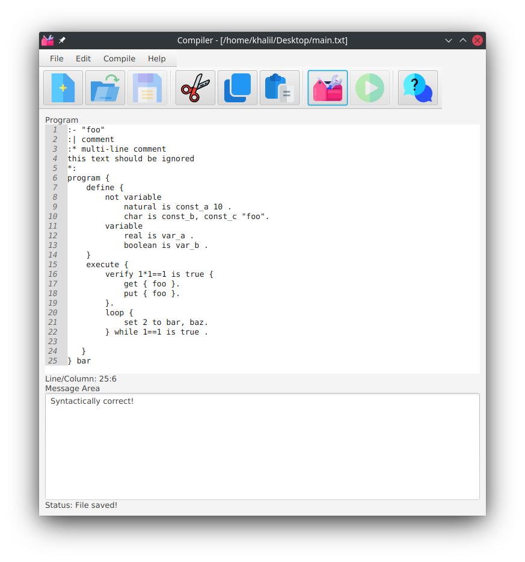

# App screenshot



---

# Downloading source

```shell
git clone https://github.com/KhalilSantana/Pluto.git
```

---

# Building

### Requirements:

1. Maven

2. OpenJDK 14

```shell
cd Pluto
mvn compile
```

---

# Packaging

```shell
mvn clean package
```

The output should be in target, you most likely will want the 'with dependencies' JAR archive.

---

# Running

From .JAR archive/package:

```shell
java -jar target/Pluto-*-jar-with-dependencies.jar
```

Or skip the package step and run this directly:

```shell
mvn javafx:run
```